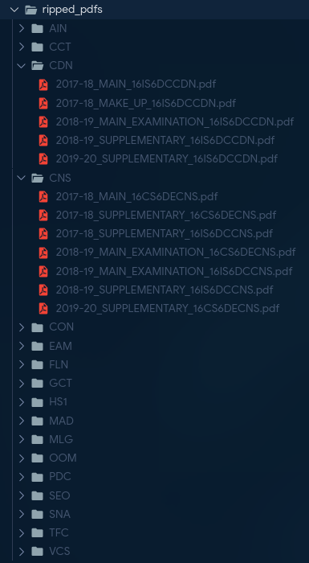

<h2 align="center"> BMSCE Question Paper Ripper </h2>
<p align="center">
  <strong>
  Rip previous year question papers from the e-library automatically in seconds.
  </strong>
  <br>
  Saves around `7+5*(3*15) = 232` clicks on average when trying to download the last 5 years papers for a particular subject of a branch.
</p>

## Features

- Much faster than manually navigating, downloading from the site
- Download specifying the Branch, Semester and last N years to retrieve papers
- Exports a list of public paper urls to CSV
- Renames the files with the exam type and year held
- Papers from different years of a particular subject are placed in a common folder

## Setup

- Clone the repo `git clone https://github.com/shaansubbaiah/bmsce-paper-ripper.git`
- Run `pip install -r requirements.txt`
- Set the branch, sem, etc in `ripper.py`
- Run `python ripper.py`

NOTE: In case you get an issue due chromedriver not being present in PATH, try following [this tutorial to add it to your path](https://zwbetz.com/download-chromedriver-binary-and-add-to-your-path-for-automated-functional-testing/)

## TODO

- Download files asynchronously
- Download papers of only a particular subject

Example Terminal Output

```
Starting Ripper
---> Opening SIXTH SEMESTER
---> Opening COMPUTER SCIENCE AND INFORMATION SCIENCE
---> Sourcing PDF links
------> Adding 2019-20_SUPPLEMENTARY Papers
------> Adding 2018-19_SUPPLEMENTARY Papers
------> Adding 2018-19_SEMESTER_MAKE_UP Papers
------> Adding 2018-19_MAIN_EXAMINATION Papers
------> Adding 2017-18_MAKE_UP Papers
------> Adding 2017-18_MAIN Papers
------> Adding 2017-18_SUPPLEMENTARY Papers
---> Extracting PUBLIC LINKS
---> Exporting CSV
---> Downloading PDFs
Ripped. 💀
```

Example folder structure generated



## Config

```
LIBRARY_URL  = e-library url (String)
USERNAME     = e-library username (String)
PASSWORD     = e-library password (String)
SEMESTER     = (String), valid semester list below
BRANCH       = (String), valid branches list below
LAST_N_YEARS = n years papers to rip (Integer), ideally 1-5
```

```
### Valid branch parameters:
# ARCHITECTURE
# BIOTECHNOLOGY
# CHEMICAL ENGINEERING
# CIVIL ENGINEERING
# COMPUTER SCIENCE AND INFORMATION SCIENCE
# ELECTRICAL AND ELECTRONIC ENGINEERING
# ELECTRONICS AND COMMUNICATION ENGINEERING
# INDUSTRIAL ENGINEERING AND MANAGEMENT
# INSTRUMENTATION ENGINEERING
# MECHANICAL ENGINEERING
# MEDICAL ELECTRONICS
# TELECOMMUNICATION ENGINEERING

### Valid semester parameters:
# FIRST SEMESTER
# SECOND SEMESTER
# THIRD SEMESTER
# FOURTH SEMESTER
# FIFTH SEMESTER
# SIXTH SEMESTER
# SEVENTH SEMESTER
# EIGHT SEMESTER

### UNSUPPORTED semester parameters:
# MATHEMATICS QUESTION PAPERS
# MBA QUESTION PAPERS
# MCA AUTONOMOUS QUESTION PAPERS
# MCA VTU Question Papers
# M.Tech QUESTION PAPERS
```
